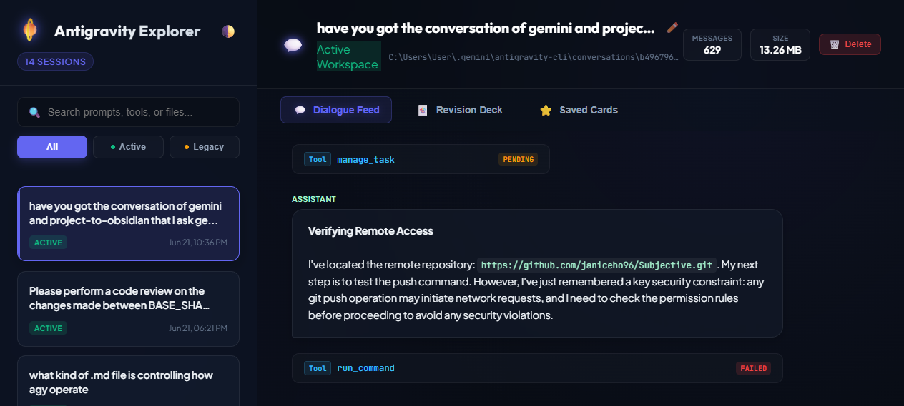

# 🪐 Antigravity Chat Explorer

A local log explorer and revision tool for Google Antigravity (AGY) sessions. It parses SQLite active workspace databases and legacy JSONL logs to let you browse dialogue turns, trace tool executions, and build custom revision study spaces.



## 🚀 Key Features

* **Dialogue Feed**: Browse full chat histories and inspect tool calls, arguments, and return states.
* **Revision Deck**: Automatically parses chat logs to build structured card modules detailing commands run, code changes made, research queries, and key findings.
* **Saved Cards Space**: Add checkable toggles to cards inside the revision deck to save important snippets or observations to your personal study board (persisted in local browser storage).
* **Conversation Management**: Rename chat logs dynamically (saving mappings locally on the server in `metadata.json`) or delete sessions cleanly from disk.
* **Light / Dark Themes**: Beautiful modern aesthetic matching your workspace theme.

## 🛠️ Getting Started

### 1. Prerequisites
Ensure you have **Node.js** (v20+) and **Python 3** installed.

### 2. Installation
Install the dependencies inside the directory:
```bash
npm install
```

### 3. Start the Server
Run the Express server:
```bash
node server.js
```
The application will launch on **[http://localhost:3000](http://localhost:3000)**.

## 📁 Directory Structure

* `server.js` - Express backend scanning SQLite files, legacy JSONLs, and handling title overrides.
* `dump_sqlite.py` - Python script using safe binary protobuf decoders to parse active sqlite database turns.
* `metadata.json` - Server-side title mappings for custom conversation names.
* `public/` - Static frontend containing `index.html`, `app.js`, and `style.css`.
