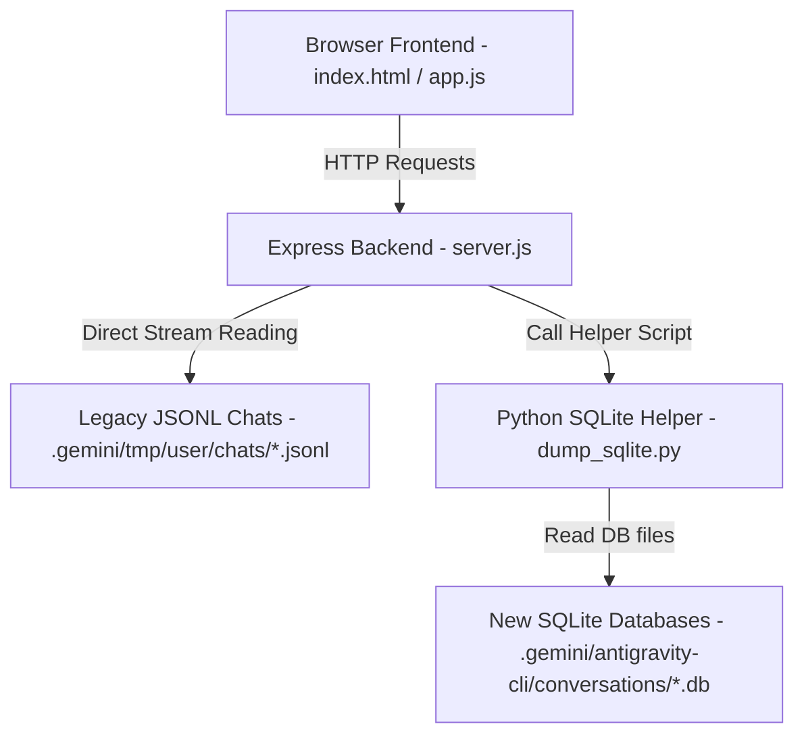

# Spec: Gemini & AI Agent Chat Explorer

A local web dashboard to view, search, and audit past conversation histories and generated files across all AI tools (`antigravity-cli`, `gemini-cli`, `claude`, `codex`).

## 1. System Architecture



## 2. Component Design

### 2.1 Backend (Node.js & Python)
* **`server.js`**:
  * Scans two chat locations: `.jsonl` legacy folder and `.db` SQLite folder.
  * **Memory Optimization:** For `/api/sessions`, it reads only the headers/tails of `.jsonl` files using stream limits, extracting `summary` and timestamps without loading large files (e.g. 97MB logs).
  * Serves frontend static files from `public/`.
* **`dump_sqlite.py`**:
  * Extracts session meta and message tables from `conversations/*.db` files.
  * Converts the internal protobuf/binary payload blocks into standard JSON structure representing user and agent messages.

### 2.2 Frontend (Single-Page App)
* **`public/index.html`**: Semantic HTML5 dashboard layout.
* **`public/style.css`**: Dark-mode glassmorphic theme (#0B0F19 background, subtle glows, CSS Grid, Inter font).
* **`public/app.js`**: Handles session loading, live filtering, and interactive message rendering.

---

## 3. API Specification

* **`GET /api/sessions`**
  * Reads both sources, returns structured metadata list:
  ```json
  [
    {
      "id": "dd01a5a0-6c90-48b4-9fe2-4131fd7ac632",
      "title": "Comic Con Project Map & Skills Summary",
      "date": "2026-06-16T19:05:00.000Z",
      "source": "legacy-jsonl",
      "size": "97.16 MB"
    }
  ]
  ```

* **`GET /api/session/:id?source=legacy-jsonl|sqlite`**
  * Parses file matching `:id`, returns chronological list of dialogue turns:
  ```json
  {
    "id": "dd01a5a0-6c90-48b4-9fe2-4131fd7ac632",
    "summary": "Import specific skills into their Obsidian vault.",
    "messages": [
      {
        "role": "User",
        "text": "help me configure telegram",
        "timestamp": "2026-06-19T13:20:43Z"
      },
      {
        "role": "Gemini",
        "text": "Starting daemon...",
        "toolCalls": [
          { "name": "run_command", "args": { "command": "gemini-cli-connect start" }, "status": "success" }
        ],
        "timestamp": "2026-06-19T13:20:44Z"
      }
    ]
  }
  ```

---

## 4. UI Layout & Visual Design

* **Sidebar:** 
  * Header with stats (Total Sessions, Active Space).
  * Live filter search input (filters by text, tool used, or date).
  * List of scrollable chat sessions styled with hover animations and active/selected states.
* **Main Chat Pane:**
  * Welcome dashboard when no session is loaded.
  * Chat header showing active session name, source type, and file path.
  * Scrollable message feed with distinct User (indigo bubble) and AI (sleek gray border with tool badge) nodes.
  * Collapsible tool execution blocks showing commands run and files modified.
